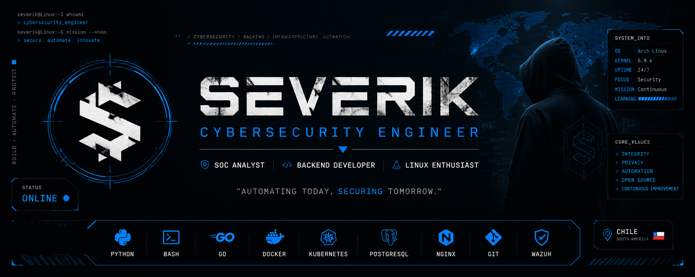

<div align="center">




<br>

> *"While I spend my days protecting systems from compromise,  
> my own heart surrendered willingly to a girl dressed in black."*

<sub>🖤 Dedicated to Sabrina - My favorite exception - IF YOU DIN'T BOTHER TO READ, MEANS I'M TAKEN, FUCK OFF.</sub>

</div>

---

<table>

<tr>

<td width="60%" valign="top">

## About Me

I'm a **Cybersecurity Engineer** passionate about infrastructure, backend development and automation.

I enjoy building reliable solutions that improve operational efficiency, strengthen security and simplify complex workflows.

## Certifications

<p align="center">


</p>

### Interests

- Cybersecurity
- Backend Development
- Linux
- Containers & Self-hosting
- Cloud Infrastructure
- Automation
- Open Source

### Currently Learning

- Threat Hunting
- Malware Analysis
- Cloud Security
- Kubernetes
- Offensive Security

</td>

<td width="40%" valign="top">

## Current Focus

- Security Engineering

- FastAPI & APIs

- Linux

- Docker

- Kubernetes

- Infrastructure

- Threat Detection

- Automation

</td>

</tr>

</table>

---

## Technologies

<div align="center">


</div>

---

## Featured Projects

| Project | Description |
| --------- | ------------- |
| - **SEVERIK DYNAMICS** | Independent IT & Cybersecurity Services |
| - **SOC Automation** | Monitoring & Incident Response |
| - **WhatsApp Validator** | Chilean business validation platform |
| - **Infrastructure Lab** | Docker, Linux & Networking |
| - **Security Research** | OSINT, Threat Intelligence & Detection |

---

## Development Environment

```yaml
Operating System:
  - Linux

Languages:
  - Python
  - Go
  - Bash
  - JavaScript
  - Rust

Backend:
  - FastAPI
  - Node.js

Infrastructure:
  - Docker
  - Kubernetes
  - PostgreSQL
  - Nginx
  - Cloudflare

Focus:
  - Cybersecurity
  - Automation
  - Infrastructure
  - Networking
```

---

## GitHub Statistics

<div align="center">


<br><br>


</div>

---

## Philosophy

> *“Love is one of the most intense feelings felt by man; another is hate. Forcing yourself to feel indiscriminate love is very unnatural. If you try to love everyone you only lessen your feelings for those who deserve your love. Repressed hatred can lead to many physical and emotional aliments. By learning to release your hatred towards those who deserve it, you cleanse yourself of these malignant emotions and need not take your pent-up hatred out on your loved ones.” - Anton Szandor LaVey*

---

<div align="center">

**Thanks for stopping by.**

*Always learning. Always building.*

</div>
